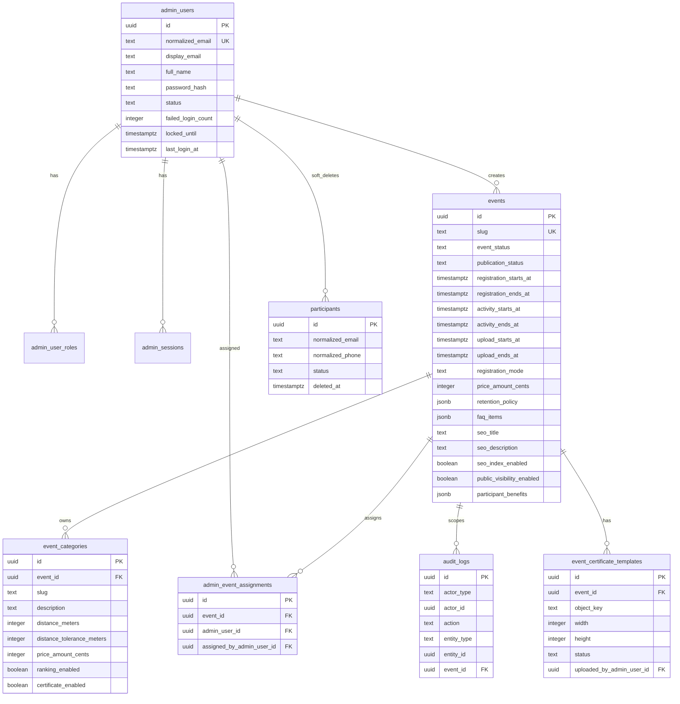
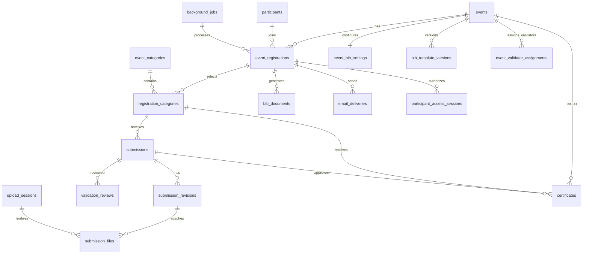

# Database

Database utama adalah PostgreSQL. Semua timestamp disimpan sebagai `timestamptz` dan
business display memakai `Asia/Jakarta`.

## Initial Migrations

Implemented migration files:

- `001_admin_authentication.sql`
- `002_events_and_categories.sql`
- `003_participants.sql`
- `004_audit_logs.sql`
- `005_event_management_vertical_slice.sql`
- `006_registration_bib_vertical_slice.sql`
- `007_add_montserrat_bib_font.sql`
- `008_submission_revision_vertical_slice.sql`
- `009_submission_validation_workflow.sql`
- `010_fix_participant_phone_constraint.sql`
- `011_make_montserrat_default_font.sql`
- `012_bib_template_lifecycle.sql`
- `013_event_create_metadata.sql`
- `014_event_certificates.sql` di backend dan `012_event_certificates.sql` di frontend legacy
  migration set

Migration runner membuat dan memakai tabel:

```sql
schema_migrations (
  version integer PRIMARY KEY,
  name text NOT NULL,
  checksum text NOT NULL,
  applied_at timestamptz NOT NULL DEFAULT now()
)
```

## Implemented ERD



## Registration, BIB, and Submission ERD Extension



Implemented tables in migration 006:

- `event_registrations`
- `registration_categories`
- `event_bib_settings`
- `bib_template_versions`
- `bib_documents`
- `participant_access_sessions`
- `idempotency_records`
- `email_deliveries`
- `background_jobs`
- `registration_security_attempts`

Implemented tables in migration 008:

- `upload_overrides`
- `submissions`
- `submission_revisions`
- `submission_files`
- `upload_sessions`
- `submission_system_events`

Implemented validation extension in migration 009:

- `event_validator_assignments`
- `validation_reviews`
- Additional validation columns on `submissions` for legacy claim state, `review_version`,
  approved revision, ranking eligibility, latest participant-visible note, and latest reason
  code.
- `events.allow_same_activity_across_categories` for future duplicate evidence policy tuning.

Implemented BIB template lifecycle extension in migration 012:

- `bib_template_versions.name`
- `bib_template_versions.description`
- `bib_template_versions.status` with `DRAFT`, `ACTIVE`, and `ARCHIVED`
- `bib_template_versions.updated_by_admin_user_id`
- `bib_template_versions.updated_at`

Implemented certificate extension:

- `event_certificate_templates` untuk template PNG private per event dengan lifecycle
  `ACTIVE` dan `ARCHIVED`.
- `certificates` untuk hasil sertifikat per registration category dengan status `PENDING`,
  `GENERATING`, `READY`, `EMAILED`, `FAILED`, dan `INVALIDATED`.
- `background_jobs` menerima type `GENERATE_CERTIFICATE` dan `SEND_CERTIFICATE_EMAIL`.
- `email_deliveries` menerima type `CERTIFICATE`.

Participant table extension:

- `city_or_regency`
- `district`
- `postal_code`
- `emergency_contact_name`
- `emergency_contact_phone`

## Constraint Rules

- Email participant aktif unik melalui partial unique index.
- Nomor HP participant aktif unik melalui partial unique index.
- Event slug unik secara global.
- Category slug unik per event.
- Event FAQ disimpan sebagai `jsonb` array.
- Category memiliki `description` nullable.
- `admin_event_assignments`, `admin_user_roles`, dan `event_validator_assignments` adalah
  legacy compatibility untuk schema lama; production authorization saat ini single admin
  app-level.
- Event/category price amount tidak boleh negatif.
- Time window event wajib memiliki start tidak setelah end.
- Audit log action dan entity type tidak boleh kosong.
- `event_registrations` has `UNIQUE (event_id, participant_id)`.
- `event_registrations` has `UNIQUE (event_id, bib_number)`.
- `registration_categories` has `UNIQUE (event_registration_id, event_category_id)`.
- Registration code credential is stored as `registration_code_hash`; lookup uses
  `registration_code_lookup`.
- Idempotency uses `UNIQUE (operation, key)` and a SHA-256 request fingerprint.
- BIB allocation locks `event_bib_settings` and advances `next_sequence`.
- BIB text font default is `Montserrat`; legacy `Inter` settings are migrated to `Montserrat`.
- BIB template path: `events/{eventId}/templates/bib/{templateVersionId}.png`.
- BIB template status controls draft/publish/archive lifecycle; only the active published
  template is referenced from `event_bib_settings.active_template_version_id`.
- BIB output path:
  `events/{eventId}/participants/{participantId}/bib/{bibDocumentId}.png`.
- Submission unique per `registration_category_id`.
- Submission revisions are append-only and numbered uniquely per submission.
- `submissions.current_revision_id` points to the latest revision.
- Screenshot evidence path:
  `events/{eventId}/submissions/{submissionId}/revisions/{revisionId}/{fileId}.jpg`.
- Participant sessions store CSRF token hash for participant submission forms.
- Active validator assignment is unique per `(event_id, admin_user_id)` sebagai constraint
  legacy.
- Active certificate template is unique per event.
- Active certificate is unique per `registration_category_id`.
- Certificate number and verification code are globally unique.
- Certificate template path:
  `events/{eventId}/templates/certificates/{templateId}.png`.
- Certificate output path:
  `events/{eventId}/certificates/{certificateId}.png`.
- Validation review actions and reason codes are protected by CHECK constraints.
- Submission claim indexes remain for legacy compatibility and future cleanup evaluation.
- Background job and email delivery type constraints include submission validation
  notification types and certificate jobs/email.

## Development Seed

`pnpm db:seed:dev` menjalankan migration lalu membuat:

- Admin `admin@beard.test` dengan password default `ChangeMe!2026`. Akun dan role demo lama
  dapat tetap ada di development seed sebagai data legacy, tetapi tidak membatasi akses admin.
- Dataset demo development idempotent dengan source `DEV_SEED`.
- Event publik dan admin-only dengan berbagai kondisi: registration open, upload open, review,
  completed, scheduled, quota kecil, dan draft/unpublished.
- Kategori 5K, 10K, 21K, dan 42K dengan variasi open, male-only, female-only, ranking,
  certificate, dan quota.
- Sekitar 80 peserta dummy `participantNNN@beard.test`, 110-140 registrasi, status BIB/email
  campuran, submission dengan status submitted/under review/approved/revision required/rejected/
  disqualified, file evidence dummy private object key, serta riwayat validasi.

Ganti password development dengan `pnpm admin:set-password admin@beard.test <password>`.

## Rollback Notes

Initial migrations bersifat additive. Untuk rollback destructive di production:

1. Ambil backup terverifikasi.
2. Stop web dan worker.
3. Jalankan SQL rollback manual yang sudah direview.
4. Verifikasi `schema_migrations`.
5. Jalankan smoke test.

Migration runner tidak menyediakan auto-down migration agar perubahan destructive tidak
terjadi tanpa review eksplisit.
